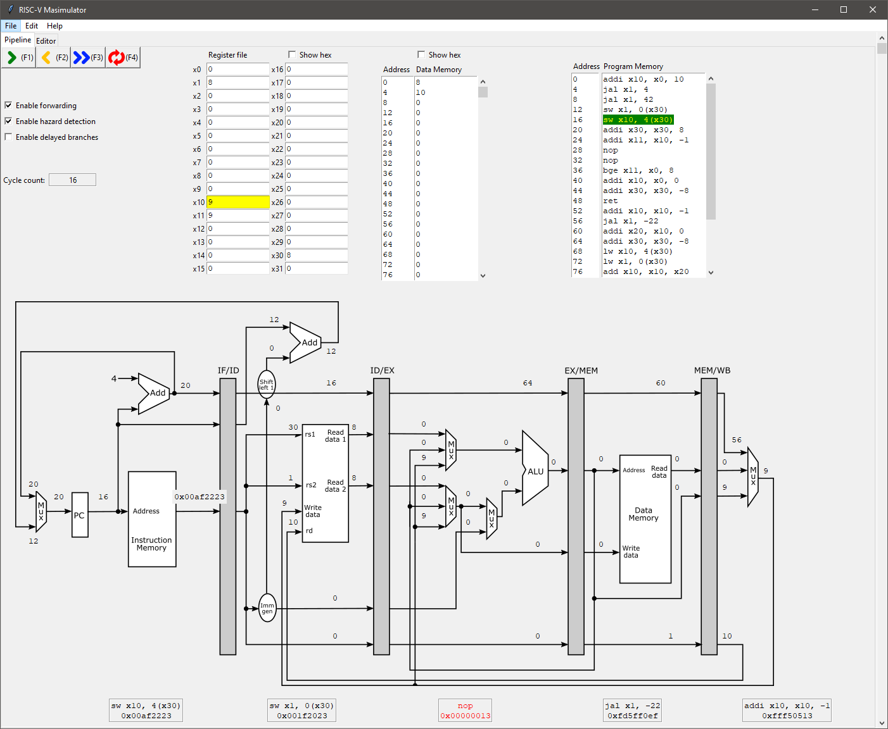

# Masimulator
A simple visual 32-bit RISC-V Simulator developed fully in Python and based on the 5-stage pipeline described in the book "Computer Organization and Design RISC-V Edition: The Hardware Software Interface":
https://www.amazon.com/gp/product/0128122757/ref=dbs_a_def_rwt_bibl_vppi_i2

For now it supports only a handful of instructions:

nop, lb, lh, lw, lui, sw, addi, add, sub, and, or, xor, beq, bne, blt, bge, bltu, bgeu, slt, sltu, jal, ret, sll, srl, sra, andi, ori, xori, slli, srli, srai, mul

But this is enough to show the functionality of a pipeline for a lab setting. The pipeline supports forwarding, hazard detection, and delayed branches which can be enabled or disabled to observe the difference.

# How to run
If you have all the required packages (such as Tkinter) then just use the following in your command line, or run main.py in your IDE of choice:

python main.py

The simulator has been tested on Windows 10 with Python 3.6

# Simulator's main window
Below is an image of the simulator's window showing the pipeline with forwarding and hazard detection activated.
The register file, data memory, and program memory are arranged from left to right. 

The register file and data memory are modifiable, so functionality can be easily tested. The current instruction (in Fetch stage) is shown in green in the program memory. Changes to the register file and data memory are shown in color in their respective windows.

There are 4 buttons on the top left, allwoing to step/backstep through the code, execute the code fully, and to restart the processor.

It is possible to load new assembly files into the program memory by going through the File menu.
There is also an editor provided with syntax highlighting to make it easier to test the system. 

# RISC-V assembler
The simulator uses the RISCV-RV32I-Assembler provided in the following repository, which is integrated into this project with some modifications:

https://github.com/metastableB/RISCV-RV32I-Assembler

